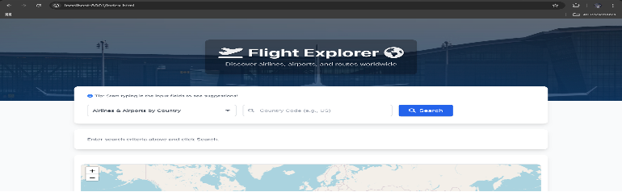

# Flight Explorer ✈️🌍

A dynamic web application allowing users to explore global airline, airport, and route data. Features include interactive map visualization (Leaflet.js), real-time weather lookup (Open-Meteo API), and various search criteria powered by a Node.js/Express backend and PostgreSQL database.

**(⚠️ Note:** This application is currently configured for local execution. See Setup instructions below.)*

---

## Screenshots


*Main search interface*


*Example map visualization with airports and routes*


*Airport details display with real-time weather*

---

## Features

*   **Comprehensive Search:** Users can search for flight data using various criteria:
    *   Airlines & Airports by Country Code
    *   Routes flown by a specific Airline (by IATA code)
    *   Detailed Airport Information (including real-time weather) by IATA code
    *   Routes Departing From or Arriving At a specific Airport (by IATA code)
    *   Airlines operating To/From a specific Airport (by IATA code)
    *   Airlines flying directly Between two Airports (by IATA codes)
    *   Calculate geographic Distance between two Airports (by IATA codes)
*   **Interactive Map:** Utilizes Leaflet.js to visually represent airport locations as markers and flight routes as connecting lines. Includes map interactions like zooming, panning, and popups on markers.
*   **Real-time Weather:** Integrates with the Open-Meteo API to display the current day's high and low temperatures when viewing airport details.
*   **Autocomplete Suggestions:** Provides helpful dropdown suggestions for country codes, airline IATA codes, and airport IATA codes as the user types, improving usability and accuracy.
*   **Dynamic UI:** The interface updates cleanly based on user selections and search results, providing feedback via loading indicators and clear error messages.
*   **Responsive Design:** Basic responsiveness implemented using Tailwind CSS for usability on different screen sizes.

---

## Technologies Used

*   **Frontend:**
    *   HTML5
    *   CSS3 (Tailwind CSS v2, Custom CSS)
    *   JavaScript (ES6+)
    *   [Leaflet.js](https://leafletjs.com/) (Interactive Maps)
    *   [Axios](https://axios-http.com/) (Promise-based HTTP client)
*   **Backend:**
    *   [Node.js](https://nodejs.org/)
    *   [Express.js](https://expressjs.com/)
*   **Database:**
    *   [PostgreSQL](https://www.postgresql.org/)
    *   [node-postgres (pg)](https://node-postgres.com/) (Node.js client)
*   **APIs:**
    *   [Open-Meteo API](https://open-meteo.com/) (Weather Data)
*   **Development & Environment:**
    *   [npm](https://www.npmjs.com/) (Package Management)
    *   [dotenv](https://github.com/motdotla/dotenv) (Environment Variable Management)
    *   Git & GitHub (Version Control)

---

## Setup and Running Locally

This project requires Node.js, npm, and a running PostgreSQL instance with the necessary database and tables created and populated (as per CS612 Assignment 1/2 specifications).

1.  **Clone the repository:**
    ```bash
    git clone https://github.com/tejakusireddy/flight-explorer-cs612.git
    cd YourRepoName
    ```
2.  **Install dependencies:**
    ```bash
    npm install
    ```
3.  **Configure Database Connection:**
    *   Copy the example environment file: `cp .env.example .env`
    *   Edit the `.env` file and replace the placeholder values with your actual PostgreSQL connection details (using the variable names **with underscores**, e.g., `PG_USER`, `PG_PASSWORD`).
4.  **Start the server:**
    ```bash
    npm start
    ```
5.  **Access the application:** Open your web browser and navigate to `http://localhost:8001`.

---

## Project Context

This project was developed as Assignment #3 for the CS612 - Concepts and Structures in Internet Computing course. It integrates concepts from database design, backend API development, frontend user interface creation, external API usage, and environment configuration.


---

*Developed by Teja Kusireddy*