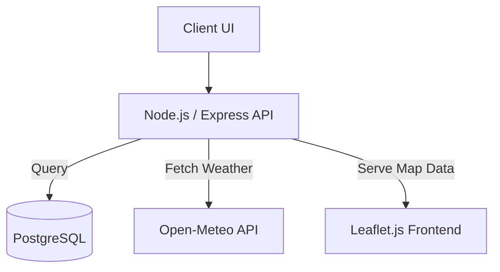
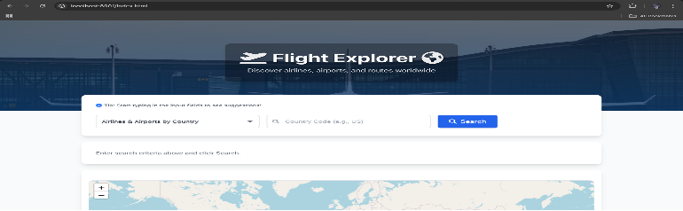

# Flight Explorer


   

**Flight Explorer** is a resilient aviation data platform built with **Node.js**, **PostgreSQL**, and **Docker**, integrating real-time weather APIs and interactive map visualizations.  
Designed for **scalable, fault-tolerant deployment**, it implements **rate limiting, retry logic**, and **CI/CD pipelines** for consistent performance across environments.

---

## Key Capabilities

- **Multi-Criteria Flight Search**  
  Search flights, routes, airlines, and airports with flexible filters.
  
- **Real-Time Weather Integration**  
  Fetch high/low temperatures for airports via **Open-Meteo API**.

- **Interactive Map Visualization**  
  Leaflet.js-based interface to view airports and flight paths.

- **Robust System Design**  
  - API rate limiting & retry mechanisms
  - Error handling & input validation
  - CI/CD via GitHub Actions
  - Dockerized for portable deployment

---

## Architecture


```mermaid
flowchart TD
    A[Client UI] --> B[Node.js / Express API]
    B -->|Query| C[(PostgreSQL)]
    B -->|Fetch Weather| D[Open-Meteo API]
    B -->|Serve Map Data| E[Leaflet.js Frontend]
```

**Tech Stack**  
- **Frontend:** HTML5, Tailwind CSS, JavaScript (ES6+), Leaflet.js  
- **Backend:** Node.js, Express.js  
- **Database:** PostgreSQL  
- **Infrastructure:** Docker, GitHub Actions (CI/CD)  
- **APIs:** Open-Meteo API  

---

## Setup

### 1. Clone & Install
```bash
git clone https://github.com/tejakusireddy/flight-explorer.git
cd flight-explorer
npm install
```

### 2. Environment Configuration
```bash
cp .env.example .env
```
Update `.env`:
```env
PG_USER=your_user
PG_PASSWORD=your_password
PG_HOST=localhost
PG_PORT=5432
PG_DATABASE=your_database
```

### 3. Run with Docker (Recommended)
```bash
docker-compose up --build
```
> Runs PostgreSQL + API server together.

Or run locally:
```bash
npm start
```

Access at: **http://localhost:8001**

---

## Deployment

This project ships with a **GitHub Actions pipeline** for:
- Build & test
- Docker image build
- Deploy to staging/production environments

---

## Screenshots

| Search Interface | Map View |
|------------------|----------|
||

---

## Author

**Teja Kusireddy**  
[GitHub](https://github.com/tejakusireddy) · [LinkedIn](https://linkedin.com/in/sai-teja-kusireddy)

---

## License
MIT License – see [LICENSE](LICENSE).
